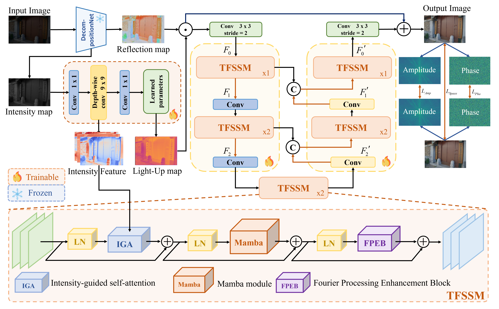
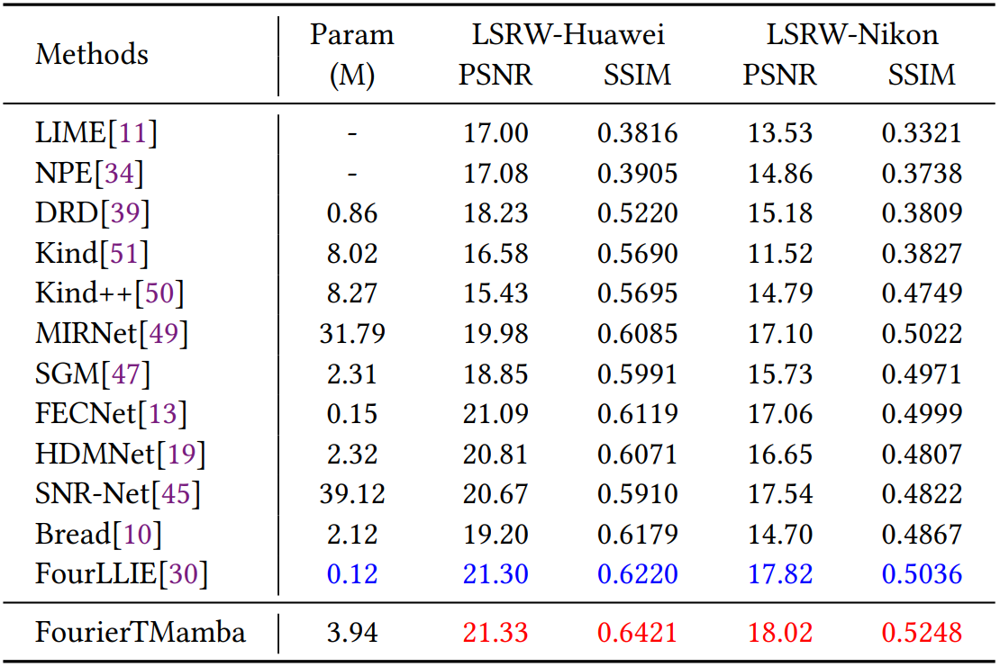

# Low-Light Image Enhancement via FourierTMamba: A HybridFrequency-Spatial Approach

> **Abstract:** Low-light image enhancement in digital imaging field is critical
for applications such as surveillance, mobile photography and autonomous driving. Currently available methods, no matter retinexbased or purely frequency-based methods, often fail to deal with
complex illumination dynamics, leading to artifacts and unnatural illuminance distribution. This paper has proposed a hybrid frequency spatial based approach named FourierTMamba, which harnesses
the strengths of Transformer, Mamba and Fourier Transform for visual details refinement and illuminance restoration. Specifically, it employs cascade strategy that integrates preliminary enhancement
based on retinex decomposition, as well as fine-grained enhancement through dual-domain hybrid structure. Comprehensive experiments on public benchmark paired and unpaired datasets have
demonstrated that the proposed FourierTMamba significantly outperforms state-of-the-art methods with relative lightweight computation burdens.

# Model structure

## Results (FourierTMamba)
Performance results of the FourierTMamba trained on paired dataset

<strong>LOL</strong> 

 

<strong>ViLSRW</strong>

 

Performance results of the FourierTMamba trained on paired dataset

<strong>Visual Results</strong>

 

## Installation
The project is built with Python 3.8, PyTorch 1.8.1. CUDA 10.2, cuDNN 7.6.5
~~~
pip install -r requirements.txt
~~~
